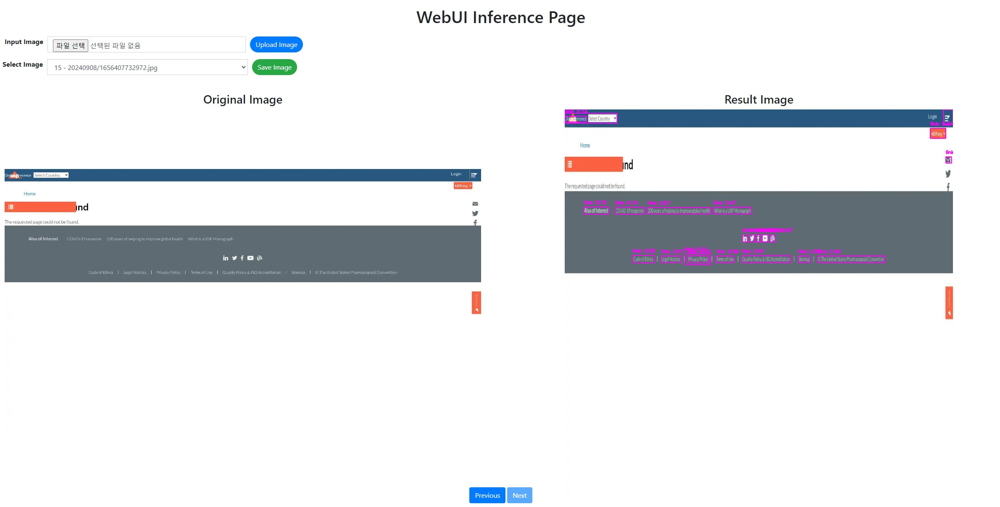

# yolov7-restapi

- [Introduce](#introduce)
- [Prerequisites](#prerequisites)
- [Installation](#installation)
- [API 결과](#api-결과)
    
## Introduce

본 프로젝트는 Neural Network의 결과를 REST API로 서비스 하기 위한 웹 서버를 제공합니다.

Python 코드로 구성되어 있으며, Django 및 Django REST framework를 사용하여 개발하였습니다.

Linux 사용을 가정하여 코드를 작성하였으며, 만약 다른 환경에서의 설치를 진행하려면 문의하시기 바랍니다.

프로젝트의 개발은 docker container에서 진행하시기를 권장합니다.

## Prerequisites

- Linux Based OS or WSL Ubuntu
  - [Install WSL Ubuntu and blow reqirements](docs/Installation/Windows.md)
- Python 3
- nvidia-driver >= 515 & CUDA >= 11.7
- docker.ce
- docker-compose==1.21.2
- nvidia-docker2


## Installation
- 이후, 디렉토리 내에서 다음과 같은 부분을 수정합니다.

1. docker-compose.yml
    * Module의 외부 통신을 위한 Port 수정이 필요하다면 다음을 수정합니다.
    ```docker
   service:
     ...
     main:
       container_name: yolov7-restapi_django
       ...
       ports:
       - "8777:8000" # -> 변경
    ```

2. docker/main.env
    * 특정 GPU만 사용하는 환경을 구성하고 싶다면 다음을 수정합니다.
    * 만약 GPU 번호를 바꾸고 싶으면 0을 1로 변경합니다.
    * torch 모델은 기본적으로 GPU를 하나만 쓰도록 설정되어 있습니다.
    ```text
    NVIDIA_VISIBLE_DEVICES=0 # -> 1
    ```    
    * all을 사용 시, 전체 GPU를 사용한다. 만약 0번 GPU만을 사용하고 싶다면 NVIDIA_VISIBLE_DEVICES=0으로 수정합니다.

- 모든 설정이 끝났다면 docker 디렉토리 내에서 ```docker-compose up -d```으로 실행하면 웹 서버가 시작됩니다.
- ```http://${SERVER_IP}:8777/```로 접근하여 접속이 되는지 확인합니다.
- 웹 서버가 실행된 것을 확인하였으면 Module 추가를 위해 main container에 docker attach로 접근하여 일단 웹 서버를 종료합니다.
    
    ```bash
    docker attach yolov7-restapi_django
    Ctrl + C
    sh server_shutdown.sh
    ```

- Docker container에 ssh 로 접속하고 싶은 경우, 아래와 같이 계정의 password를 설정하고 ssh service를 시작한다.
  ```bash
  passwd
  service ssh start
  ```
 

## API 결과

```json
{
    "count": 2,
    "next": null,
    "previous": null,
    "results": [
        {
            "token": 10,
            "image": "http://mlcoconut.sogang.ac.kr:28777/media/20240908/sfsf_osc5mZA.jpg",
            "uploaded_date": "2024-09-08T16:47:55.713443+09:00",
            "updated_date": "2024-09-08T16:47:57.610382+09:00",
            "result_images": [
                {
                    "image": "http://mlcoconut.sogang.ac.kr:28777/media/20240908/sfsf_osc5mZA_result_0.png",
                    "uploaded_date": "2024-09-08T16:47:56.442176+09:00"
                },
                {
                    "image": "http://mlcoconut.sogang.ac.kr:28777/media/20240908/sfsf_osc5mZA_result_1.png",
                    "uploaded_date": "2024-09-08T16:47:56.665659+09:00"
                },
                {
                    "image": "http://mlcoconut.sogang.ac.kr:28777/media/20240908/sfsf_osc5mZA_result_2.png",
                    "uploaded_date": "2024-09-08T16:47:56.895249+09:00"
                },
                {
                    "image": "http://mlcoconut.sogang.ac.kr:28777/media/20240908/sfsf_osc5mZA_result_3.png",
                    "uploaded_date": "2024-09-08T16:47:57.122833+09:00"
                },
                {
                    "image": "http://mlcoconut.sogang.ac.kr:28777/media/20240908/sfsf_osc5mZA_result_4.png",
                    "uploaded_date": "2024-09-08T16:47:57.355226+09:00"
                },
                {
                    "image": "http://mlcoconut.sogang.ac.kr:28777/media/20240908/sfsf_osc5mZA_result_5.png",
                    "uploaded_date": "2024-09-08T16:47:57.588943+09:00"
                }
            ],
            "result": [
                {
                    "label": [
                        {
                            "score": 0.10294992476701736,
                            "class_idx": 1,
                            "description": "image"
                        }
                    ],
                    "position": {
                        "h": 114.0,
                        "w": 86.0,
                        "x": 716.0,
                        "y": 687.0
                    }
                },
                {
                    "label": [
                        {
                            "score": 0.10742252320051192,
                            "class_idx": 1,
                            "description": "image"
                        }
                    ],
                    "position": {
                        "h": 49.0,
                        "w": 61.0,
                        "x": 843.0,
                        "y": 532.0
                    }
                },
                {
                    "label": [
                        {
                            "score": 0.10997308790683746,
                            "class_idx": 1,
                            "description": "image"
                        }
                    ],
                    "position": {
                        "h": 68.0,
                        "w": 42.0,
                        "x": 618.0,
                        "y": 710.0
                    }
                },
                {
                    "label": [
                        {
                            "score": 0.11338264495134354,
                            "class_idx": 4,
                            "description": "link"
                        }
                    ],
                    "position": {
                        "h": 29.0,
                        "w": 91.0,
                        "x": 468.0,
                        "y": 844.0
                    }
                },
                {
                    "label": [
                        {
                            "score": 0.1173076182603836,
                            "class_idx": 0,
                            "description": "text"
                        }
                    ],
                    "position": {
                        "h": 112.0,
                        "w": 830.0,
                        "x": 99.0,
                        "y": 502.0
                    }
                }
            ]
        }
    ]
}
```
- 웹페이지 분석 모델은 이미지를 입력으로 받아 결과 이미지와 분석 결과를 출력한다.
- 원본 이미지의 주소는 ```image```, 결과 이미지의 주소는 ```result_image```로 표시되며 결과 이미지에는 객체 bounding box, 객체 종류, 추론 점수가 표시된다.

## How to use
- 웹페이지 이미지를 분석할 수 있는 페이지가 존재한다.
- 접속 URL : **http://{SERVER_IP}:{WEB_PORT}/results**

- 해당 페이지 기능
  - 이미지 입력 : 웹페이지 이미지를 입력하여 지정된 웹 객체("text", "image", "button", "heading", "link", "input")를 찾고 추론 이미지를 보여준다.
    - Confidence Threshold : Threshold 값을 설정하여 일정 값 이상의 박스만 나오게 확인 가능
  - 이미지 확인 : 입력된 이미지에 따라 추론된 이미지(전체 클래스 포함, 각 클래스별 이미지)를 확인 가능하다.
  - 이미지 저장 : 추론된 이미지를 저장할 수 있다.
